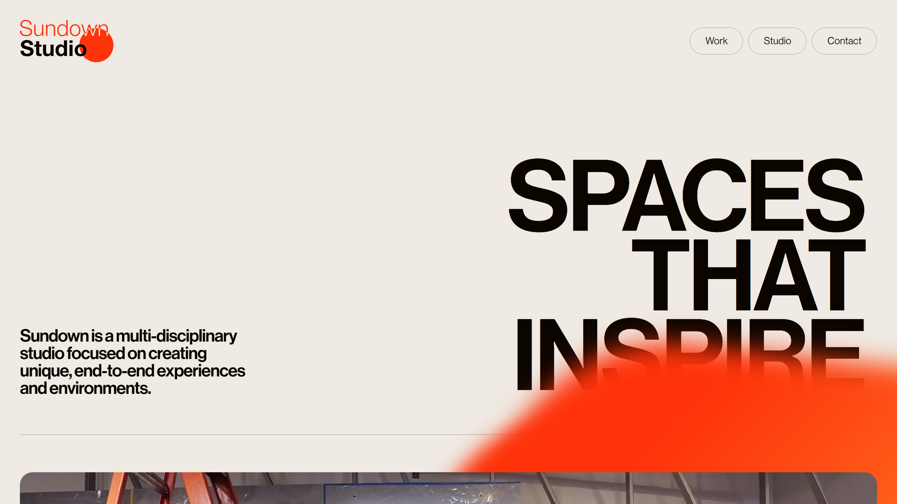

# Sundown Studios

[](https://muhammadkaifnazeer.github.io/sundownstudios/) 

<a href="https://muhammadkaifnazeer.github.io/sundownstudios/" target="_blank" rel="noopener noreferrer">
<button>Visit Site</button>
</a>  ## About Sundown Studios

This project is a faithful recreation of the official Sundown Studios landing page. It serves as a learning and practice exercise for front-end development techniques.

## Technologies Used

This project is built using the following web development technologies:

* **HTML:** The foundation for structuring the website's content.
* **CSS:** Responsible for styling the website's visual elements.
* **JavaScript:** Provides interactivity and advanced functionality.

## JavaScript Libraries

To enhance interactivity and streamline development, Sundown Studios utilizes the following JavaScript libraries:

* **Locomotive Scroll:** Delivers a smooth and immersive scrolling experience.
* **Swiper.js:** Simplifies the creation of swiping content sections for a dynamic user interface.

All required JavaScript libraries are included using Content Delivery Networks (CDNs) for optimal performance.

## About Me - Muhammad Kaif Nazeer

I'm Muhammad Kaif Nazeer, a full-stack web developer passionate about creating engaging and user-friendly web experiences. Sundown Studios is a testament to my skills in design, development, and code implementation.

Feel free to explore my portfolio website for more of my work: [Your Portfolio Website Link](https://muhammadkaifnazeer.netlify.app)  ```
